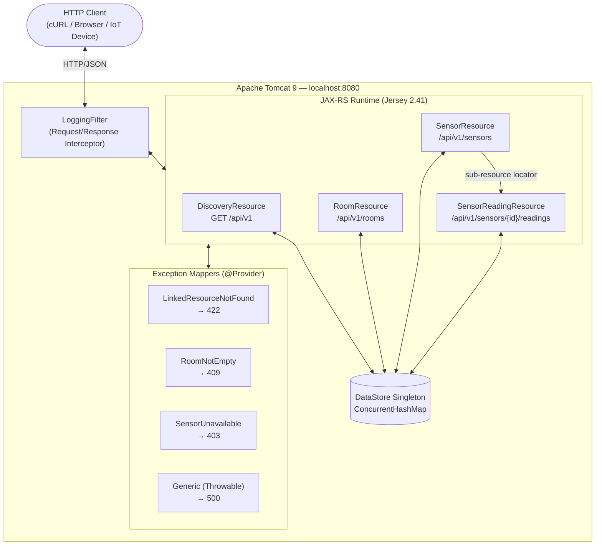
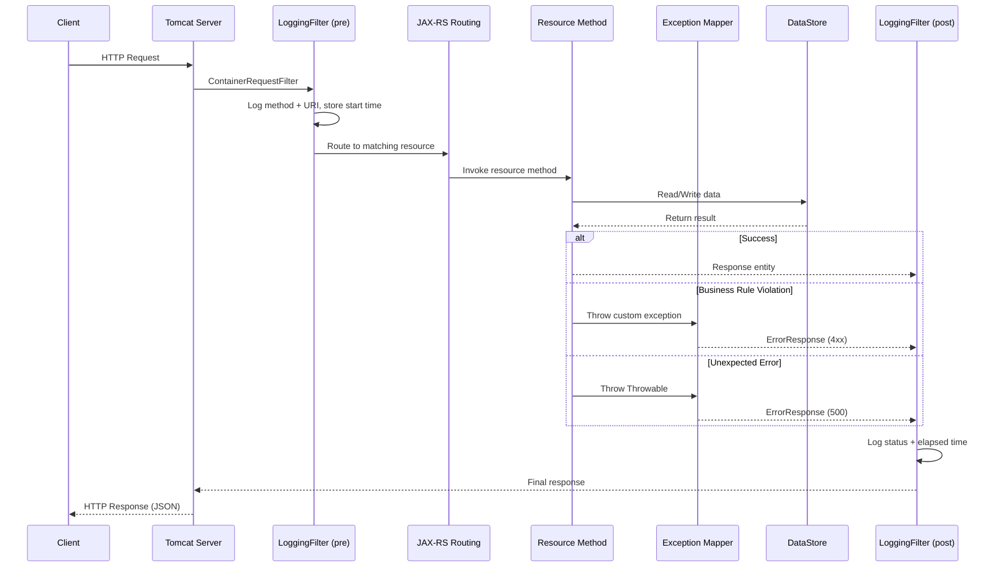
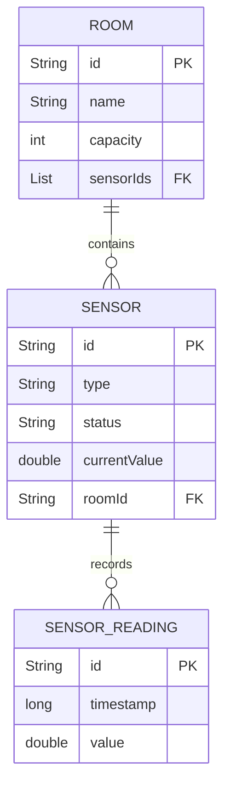
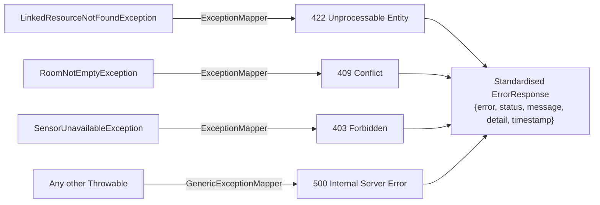

# Smart Campus — Sensor & Room Management API

Name: A.L.A.J Wijesekara
Student ID: w2152988
Module: 5COSC022W

> A lightweight JAX-RS microservice for managing campus IoT infrastructure — rooms, sensors, and sensor reading telemetry.
> Coursework submission for Smart Campus API (JAX-RS, IIT)


## Table of Contents

**Professional Sections**

1. [Overview](#1-overview)
2. [Technology Stack](#2-technology-stack)
3. [System Architecture](#3-system-architecture)
4. [Project Structure](#4-project-structure)
5. [Getting Started](#5-getting-started)
6. [API Reference](#6-api-reference)

**Coursework Report**

7. [Part 1 – Service Architecture & Setup](#7-part-1--service-architecture--setup)
8. [Part 2 – Room Management](#8-part-2--room-management)
9. [Part 3 – Sensor Operations & Linking](#9-part-3--sensor-operations--linking)
10. [Part 4 – Deep Nesting with Sub-Resources](#10-part-4--deep-nesting-with-sub-resources)
11. [Part 5 – Advanced Error Handling, Exception Mapping & Logging](#11-part-5--advanced-error-handling-exception-mapping--logging)

**Reference**

12. [Sample cURL Commands](#12-sample-curl-commands)
13. [Troubleshooting](#13-troubleshooting)
14. [Security Considerations](#14-security-considerations)
15. [Known Limitations](#15-known-limitations)

---

## 1. Overview

The **Smart Campus Sensor & Room Management API** is a RESTful microservice built on **JAX-RS (Jersey 2.41)** deployed to **Apache Tomcat 9**, designed for campus facilities management and IoT sensor telemetry pipelines.

The service exposes a versioned REST API under **/api/v1** for creating and querying campus rooms, registering IoT sensors, and collecting time-series sensor readings. All resources are discoverable from a single **HATEOAS** entry point at **GET /api/v1**.

### Key Capabilities

| Capability                     | Description                                                                            |
| ------------------------------ | -------------------------------------------------------------------------------------- |
| **Room Management**            | Full CRUD for physical campus rooms                                                    |
| **Sensor Registry**            | Register and manage IoT sensors linked to rooms; filter by sensor type                 |
| **Reading Ingestion**          | Ingest and retrieve time-series readings per sensor with sensor-state enforcement      |
| **HATEOAS Discovery**          | Self-describing API root that exposes all resource links (Richardson Maturity Level 3) |
| **Structured Error Responses** | Consistent JSON error envelope with HTTP status, message, and timestamp                |
| **Request Auditing**           | Per-request/response logging with elapsed time via a JAX-RS `ContainerRequestFilter`   |

> **Note:** This service uses an in-memory **ConcurrentHashMap** store. Data is not persisted across restarts and is intended for development and demonstration environments only.

---

## 2. Technology Stack

| Component            | Technology              | Version        | Purpose                                                   |
| -------------------- | ----------------------- | -------------- | --------------------------------------------------------- |
| Language             | Java                    | 11             | Core runtime                                              |
| REST Framework       | JAX-RS / Jersey         | 2.41           | Resource routing, serialisation, and lifecycle management |
| Servlet Container    | Apache Tomcat           | 9.x            | Hosts the WAR; provides Servlet 4.0 runtime               |
| JSON Binding         | Jackson                 | Jersey-bundled | POJO ↔ JSON marshalling via **MessageBodyReader/Writer**  |
| Dependency Injection | HK2                     | Jersey-bundled | **@Context** injection inside resource and filter classes |
| API Specification    | JAX-RS 2.1 (Jakarta EE) | 2.1            | Annotation-driven, contract-first REST design             |
| Build Tool           | Apache Maven            | 3.6+           | Dependency management and build lifecycle                 |
| Packaging            | maven-war-plugin (WAR)  | 3.4.0          | Standard WAR artifact deployed to Tomcat                  |

---

## 3. System Architecture

### High-Level Overview

The Smart Campus API follows a **layered architecture** built on top of the JAX-RS specification (Jersey 2.41) deployed as a WAR to **Apache Tomcat 9**. Jersey's **ServletContainerInitializer** discovers **SmartCampusApplication** automatically via the **@ApplicationPath("/api/v1")** annotation — no **web.xml** servlet registration required.



---

### Request Lifecycle

Every HTTP request flows through the following pipeline before a response is returned to the client:



---

### Data Model & Relationships



- **Room → Sensor (One-to-Many):** A room maintains a list of sensor IDs. Each sensor holds a **roomId** foreign key. Sensors cannot be created without referencing a valid room.
- **Sensor → SensorReading (One-to-Many):** Readings are an append-only history. Posting a new reading automatically updates the parent sensor's **currentValue**.
- **Deletion Constraints:** A room cannot be deleted while it still has sensors assigned (**409 Conflict**). Deleting a sensor automatically unlinks it from its parent room.

---

### Exception Handling Architecture



All exceptions are mapped by dedicated **ExceptionMapper<T>** providers. **No raw stack traces** are ever leaked to API consumers. Every custom exception mapper **logs the violation at WARNING level** server-side for audit purposes. The **GenericExceptionMapper** catches all unhandled **Throwable** instances, logs them internally at SEVERE level, and returns a sanitised response.

---

### Component Responsibilities

| Layer             | Component                         | Responsibility                                                                                    |
| ----------------- | --------------------------------- | ------------------------------------------------------------------------------------------------- |
| **Entry Point**   | Tomcat + `SmartCampusApplication` | Tomcat boots the WAR; Jersey discovers `@ApplicationPath` and registers all components            |
| **Configuration** | `SmartCampusApplication.java`     | Extends `ResourceConfig`; enables classpath scanning for `@Path` and `@Provider` classes          |
| **Resources**     | `DiscoveryResource`               | HATEOAS entry point — returns API metadata and navigational links                                 |
|                   | `RoomResource`                    | Full CRUD for campus rooms (GET, POST, PUT, DELETE) with per-resource HATEOAS links               |
|                   | `SensorResource`                  | CRUD for sensors with type filtering and HATEOAS links; acts as sub-resource locator for readings |
|                   | `SensorReadingResource`           | Sub-resource handling sensor reading history (GET, POST) with HATEOAS links                       |
|                   | `HateoasHelper`                   | Utility that builds `_links` maps for rooms, sensors, and readings                                |
| **Storage**       | `DataStore`                       | Thread-safe singleton using `ConcurrentHashMap`; pre-seeded with sample data                      |
| **Exceptions**    | Custom exceptions + Mappers       | Translate business rule violations into structured JSON error responses                           |
| **Filter**        | `LoggingFilter`                   | Cross-cutting request/response logging with elapsed time tracking                                 |

---

### Key Design Decisions

| Decision                                        | Rationale                                                                                                                                                                                                   |
| ----------------------------------------------- | ----------------------------------------------------------------------------------------------------------------------------------------------------------------------------------------------------------- |
| **Apache Tomcat 9** WAR deployment              | Standard servlet container; enables NetBeans Run/Deploy integration out of the box                                                                                                                          |
| **In-memory **ConcurrentHashMap\*\*\*\* storage | Thread-safe without external DB dependencies; suitable for demonstration and prototyping                                                                                                                    |
| **Sub-resource locator** for readings           | Enforces REST hierarchy (**/sensors/{id}/readings**); separates concerns between sensor CRUD and reading history                                                                                            |
| **Per-request resource lifecycle**              | Default JAX-RS behaviour; forces shared state into the thread-safe **DataStore** singleton                                                                                                                  |
| **HATEOAS per-resource links**                  | Every resource response includes **\_links** — rooms and sensors get self, update, delete, collection, and relationship links; readings get self, sensor, and collection — full Richardson Maturity Level 3 |
| **WAR** via maven-war-plugin                    | Standard deployable artifact; drop into any Tomcat **webapps/** folder                                                                                                                                      |

---

## 4. Project Structure

```
smart_campus_api/
├── pom.xml                              # Maven project descriptor
├── README.md                            # This document
├── src/main/webapp/WEB-INF/
│   └── web.xml                          # Minimal Servlet 3.1 descriptor (Tomcat)
└── src/main/java/com/w2152988/smartcampus/
    ├── SmartCampusApplication.java      # JAX-RS Application (@ApplicationPath("/api/v1"))
    ├── model/
    │   ├── Room.java                    # Room POJO
    │   ├── Sensor.java                  # Sensor POJO
    │   ├── SensorReading.java           # SensorReading POJO
    │   └── ErrorResponse.java           # Standardised error body
    ├── storage/
    │   └── DataStore.java               # Thread-safe singleton in-memory store
    ├── resource/
    │   ├── DiscoveryResource.java       # GET /api/v1 — HATEOAS metadata & links
    │   ├── RoomResource.java            # /api/v1/rooms — full CRUD with per-resource HATEOAS links
    │   ├── SensorResource.java          # /api/v1/sensors — CRUD + sub-resource locator with HATEOAS links
    │   ├── SensorReadingResource.java   # Sub-resource: /api/v1/sensors/{id}/readings with HATEOAS links
    │   └── HateoasHelper.java           # Utility that builds _links maps for all resource responses
    ├── exception/
    │   ├── RoomNotEmptyException.java
    │   ├── LinkedResourceNotFoundException.java
    │   ├── SensorUnavailableException.java
    │   └── mapper/
    │       ├── RoomNotEmptyExceptionMapper.java          # → 409 Conflict (logged)
    │       ├── LinkedResourceNotFoundExceptionMapper.java # → 422 Unprocessable Entity (logged)
    │       ├── SensorUnavailableExceptionMapper.java     # → 403 Forbidden (logged)
    │       └── GenericExceptionMapper.java               # → 500 Internal Server Error (logged)
    └── filter/
        └── LoggingFilter.java           # Request & response logging with elapsed time
```

---

## 5. Getting Started

### Prerequisites

| Tool          | Required Version | Verify Command        |
| ------------- | ---------------- | --------------------- |
| Java (JDK)    | 11 or later      | `java -version`       |
| Apache Maven  | 3.6 or later     | `mvn -version`        |
| Apache Tomcat | 9.x              | Check `CATALINA_HOME` |

> **Note:** Ensure `JAVA_HOME` points to a JDK 11+ installation. Using a JRE-only distribution will cause compilation to fail.

### Build

```bash
mvn clean package
```

Produces `target/smart-campus-api.war`.

### Deploy to Tomcat

**Option A — Manual copy:**

```bash
cp target/smart-campus-api.war $CATALINA_HOME/webapps/
$CATALINA_HOME/bin/startup.sh
```

**Option B — NetBeans (recommended):**

1. **Tools → Servers → Add Server → Apache Tomcat 9**
2. Right-click project → **Properties → Run → Server** → select your Tomcat instance
3. Click **Run** — NetBeans builds and deploys the WAR automatically

On successful startup Tomcat logs:

```
INFO: Deploying web application archive [.../smart-campus-api.war]
```

### Runtime Configuration

| Property      | Default Value                                   | Description                                                                         |
| ------------- | ----------------------------------------------- | ----------------------------------------------------------------------------------- |
| Context path  | `/smart-campus-api`                             | Derived from the WAR filename                                                       |
| API base path | `http://localhost:8080/smart-campus-api/api/v1` | Full URL to reach any endpoint                                                      |
| Data seed     | Enabled                                         | Rooms: `LIB-301`, `ENG-102`, `ROOM-101` · Sensors: `TEMP-001`, `CO2-001`, `OCC-001` |

---

## 6. API Reference

**Base URL:** `http://localhost:8080/smart-campus-api/api/v1`

**Content negotiation:** All request and response bodies use `application/json`. Sending a different `Content-Type` on `POST`/`PUT` requests returns `415 Unsupported Media Type`.

---

### Discovery

| Method | Path      | Description                                                     | Status   |
| ------ | --------- | --------------------------------------------------------------- | -------- |
| `GET`  | `/api/v1` | API metadata, version, contact, and navigational resource links | `200 OK` |

#### Sample Response — `GET /api/v1`

```json
{
  "name": "Smart Campus Sensor & Room Management API",
  "version": "1.0.0",
  "description": "University of Westminster Smart Campus initiative...",
  "timestamp": "2026-04-19T10:00:00Z",
  "contact": {
    "organisation": "University of Westminster — Campus Facilities Management",
    "administrator": "Smart Campus DevOps Team",
    "email": "facilities@westminster.ac.uk"
  },
  "_links": {
    "self": {
      "href": "http://localhost:8080/smart-campus-api/api/v1/",
      "method": "GET",
      "description": "This discovery endpoint"
    },
    "rooms": {
      "href": "http://localhost:8080/smart-campus-api/api/v1/rooms",
      "method": "GET",
      "description": "List or manage all campus rooms"
    },
    "sensors": {
      "href": "http://localhost:8080/smart-campus-api/api/v1/sensors",
      "method": "GET",
      "description": "List or manage all deployed sensors"
    },
    "sensors_by_type": {
      "href": "http://localhost:8080/smart-campus-api/api/v1/sensors?type={sensorType}",
      "method": "GET",
      "description": "Filter sensors by type (e.g. Temperature, CO2, Occupancy)"
    }
  }
}
```

---

### Rooms (`/api/v1/rooms`)

| Method   | Path                     | Description                                   | Success Status   |
| -------- | ------------------------ | --------------------------------------------- | ---------------- |
| `GET`    | `/api/v1/rooms`          | List all rooms                                | `200 OK`         |
| `POST`   | `/api/v1/rooms`          | Create a new room                             | `201 Created`    |
| `GET`    | `/api/v1/rooms/{roomId}` | Get room by ID                                | `200 OK`         |
| `PUT`    | `/api/v1/rooms/{roomId}` | Update a room                                 | `200 OK`         |
| `DELETE` | `/api/v1/rooms/{roomId}` | Delete a room (must have no sensors assigned) | `204 No Content` |

#### Sample Request — `POST /api/v1/rooms`

```json
{ "id": "SCI-201", "name": "Science Block Lab", "capacity": 30 }
```

#### Sample Response — `201 Created`

```json
{
  "id": "SCI-201",
  "name": "Science Block Lab",
  "capacity": 30,
  "sensorIds": [],
  "_links": {
    "self": {
      "href": "http://localhost:8080/smart-campus-api/api/v1/rooms/SCI-201",
      "method": "GET",
      "description": "This room"
    },
    "update": {
      "href": "http://localhost:8080/smart-campus-api/api/v1/rooms/SCI-201",
      "method": "PUT",
      "description": "Update this room"
    },
    "delete": {
      "href": "http://localhost:8080/smart-campus-api/api/v1/rooms/SCI-201",
      "method": "DELETE",
      "description": "Delete this room (must have no sensors)"
    },
    "collection": {
      "href": "http://localhost:8080/smart-campus-api/api/v1/rooms",
      "method": "GET",
      "description": "All rooms"
    }
  }
}
```

---

### Sensors (`/api/v1/sensors`)

| Method   | Path                         | Description                                                  | Success Status   |
| -------- | ---------------------------- | ------------------------------------------------------------ | ---------------- |
| `GET`    | `/api/v1/sensors`            | List all sensors; optional `?type=` query filter             | `200 OK`         |
| `POST`   | `/api/v1/sensors`            | Register a sensor (`roomId` must reference an existing room) | `201 Created`    |
| `GET`    | `/api/v1/sensors/{sensorId}` | Get sensor by ID                                             | `200 OK`         |
| `PUT`    | `/api/v1/sensors/{sensorId}` | Update a sensor                                              | `200 OK`         |
| `DELETE` | `/api/v1/sensors/{sensorId}` | Remove a sensor and unlink from its room                     | `204 No Content` |

**`?type=` filter values (case-insensitive):** `Temperature` · `CO2` · `Occupancy` · `Lighting`

**`status` values:** `ACTIVE` · `MAINTENANCE` · `OFFLINE`

#### Sample Request — `POST /api/v1/sensors`

```json
{
  "id": "TEMP-002",
  "type": "Temperature",
  "status": "ACTIVE",
  "currentValue": 21.5,
  "roomId": "SCI-201"
}
```

---

### Sensor Readings (`/api/v1/sensors/{sensorId}/readings`)

| Method | Path                                              | Description                           | Success Status |
| ------ | ------------------------------------------------- | ------------------------------------- | -------------- |
| `GET`  | `/api/v1/sensors/{sensorId}/readings`             | Get full reading history for a sensor | `200 OK`       |
| `POST` | `/api/v1/sensors/{sensorId}/readings`             | Submit a new reading                  | `201 Created`  |
| `GET`  | `/api/v1/sensors/{sensorId}/readings/{readingId}` | Get a specific reading by ID          | `200 OK`       |

> **Note:** Submitting a reading to a sensor with `status` of `MAINTENANCE` or `OFFLINE` returns `403 Forbidden`. Reading values must be finite numbers (`NaN` and `Infinity` are rejected with `400 Bad Request`). On success, the parent sensor's `currentValue` is automatically updated to the submitted value.

#### Sample Request — `POST .../readings`

```json
{ "value": 23.7 }
```

#### Sample Response — `201 Created`

```json
{
  "id": "a1b2c3d4-e5f6-7890-abcd-ef1234567890",
  "timestamp": 1744704000000,
  "value": 23.7,
  "_links": {
    "self": {
      "href": "http://localhost:8080/smart-campus-api/api/v1/sensors/TEMP-001/readings/a1b2c3d4-e5f6-7890-abcd-ef1234567890",
      "method": "GET",
      "description": "This reading"
    },
    "sensor": {
      "href": "http://localhost:8080/smart-campus-api/api/v1/sensors/TEMP-001",
      "method": "GET",
      "description": "The sensor that recorded this reading"
    },
    "collection": {
      "href": "http://localhost:8080/smart-campus-api/api/v1/sensors/TEMP-001/readings",
      "method": "GET",
      "description": "All readings for this sensor"
    }
  }
}
```

---

### Error Response Reference

All error responses return a consistent JSON envelope:

```json
{
  "error": "Unprocessable Entity",
  "status": 422,
  "message": "The roomId 'FAKE-999' does not reference an existing room.",
  "detail": "A foreign-key reference in the request body could not be resolved. Verify that all referenced identifiers (e.g. roomId) correspond to existing entities before retrying.",
  "timestamp": "2026-04-19T10:30:00Z"
}
```

| Status                       | Condition                                                     |
| ---------------------------- | ------------------------------------------------------------- |
| `400 Bad Request`            | Missing or blank required fields in the request body          |
| `403 Forbidden`              | Submitting a reading to a `MAINTENANCE` or `OFFLINE` sensor   |
| `404 Not Found`              | The requested resource does not exist                         |
| `409 Conflict`               | Attempting to delete a room that still has sensors assigned   |
| `415 Unsupported Media Type` | Request `Content-Type` is not `application/json`              |
| `422 Unprocessable Entity`   | Sensor payload references a `roomId` that does not exist      |
| `500 Internal Server Error`  | Unexpected error — stack trace suppressed; logged server-side |

---

## 7. Part 1 – Service Architecture & Setup

---

### Q1: What is the default lifecycle of a JAX-RS resource class, and how does it affect data management in this implementation?

**Answer:**

By default, JAX-RS creates a **new resource class instance per HTTP request** (per-request lifecycle). This means instance variables are reset on every request and cannot hold cross-request state. All shared, mutable data must therefore live outside the resource classes — in this implementation, inside the `DataStore` singleton, which uses `ConcurrentHashMap` for thread-safe concurrent access.

**Explanation:**

Because each request gets its own resource object, any data stored as an instance field would be lost the moment the response is sent. This means instance variables inside `RoomResource`, `SensorResource`, etc. cannot be used to persist data across requests.

Instead, all shared mutable state lives in the `DataStore` singleton — a class-level, application-wide object. Internally, the `DataStore` uses `ConcurrentHashMap` — a thread-safe data structure that allows multiple threads to read and write concurrently without corrupting data or causing race conditions. This eliminates the need for explicit `synchronized` blocks in resource methods, keeping business logic clean while still being safe under concurrent load.

---

### Q2: What is HATEOAS and why does it improve REST API design over static documentation?

**Answer:**

**HATEOAS** (Hypermedia as the Engine of Application State) means the API embeds navigational links in its responses, so clients can discover available operations at runtime rather than relying on hardcoded URLs or external docs. Our `GET /api/v1` discovery endpoint implements this principle at the API root, and every individual resource response (rooms, sensors, readings) includes its own `_links` block — making this a **Level 3** Richardson Maturity Model implementation, the highest level of REST maturity.

**Explanation:**

Our Discovery endpoint at `GET /api/v1` returns navigational links to the primary resource collections (rooms, sensors). This embodies the HATEOAS principle in practice.

**Benefits compared to static documentation:**

1. **Self-describing API:** Clients discover available resources and actions by following links in the response, rather than hard-coding URIs from a separate document. Every room, sensor, and reading response includes `_links` to its own URL (`self`), related resources (e.g., a sensor's parent `room`, its `readings`), and the parent `collection`.
2. **Decoupled evolution:** If the server changes its URL structure (e.g., `/v1/rooms` → `/v2/rooms`), clients that follow links adapt automatically, whereas clients with hardcoded paths break.
3. **Reduced onboarding friction:** A developer can explore the full API starting from a single root URL — each response guides them to the next available action, much like navigating a website.
4. **Single source of truth:** The API itself is the authoritative source of available operations, eliminating drift between documentation and actual server behaviour.
5. **Per-resource navigation:** Individual `GET /rooms/{id}` and `GET /sensors/{id}` responses include links for `self`, `update`, `delete`, and related resources — so a client never needs to construct URLs manually.

---

## 8. Part 2 – Room Management

---

### Q1: What are the trade-offs of returning full room objects vs. IDs only from `GET /api/v1/rooms`?

**Answer:**

Returning **full objects** (our approach) reduces HTTP round-trips and is optimal when clients typically consume most resource fields. Returning **IDs only** minimises payload size but triggers the N+1 problem — the client must make a separate `GET` for every room's detail, drastically increasing latency and server load. Our choice is appropriate for this scale; larger deployments should add **pagination** and **sparse fieldset** support.

**Explanation:**

**Returning full objects (our approach):**

- **Pros:** The client receives all fields in a single request, reducing round-trips. Efficient when the client typically needs most or all of the room's data.
- **Cons:** Larger payloads consume more bandwidth. For a campus with thousands of rooms, this could become a performance concern.

**Returning only IDs:**

- **Pros:** Very small response payloads; minimal bandwidth usage.
- **Cons:** The client must make an additional `GET` for each room's details — the classic **N+1 problem** — dramatically increasing total latency and server load.

**Best practice:** For this API's scale, returning full objects is appropriate. The implementation also supports **pagination** via `?page=0&size=20` on all collection endpoints to bound payload size as data grows.

---

### Q2: Is the `DELETE /rooms/{roomId}` operation idempotent? Justify with HTTP response codes.

**Answer:**

**Yes — `DELETE` is idempotent.** The first call removes the resource and returns `204 No Content`. A second identical call finds nothing and returns `404 Not Found`. Crucially, the **server state** is identical after both calls (the room does not exist) — which is the definition of idempotency. The response code may differ; the state does not.

**Explanation:**

- **First call:** The room is found and deleted → `204 No Content`.
- **Second (identical) call:** The room no longer exists → `404 Not Found`.
- **Server state:** After both calls, the state is identical — the room does not exist.

Idempotency requires only that the **server state** be the same each time, not that the **response code** be the same. Since sending the same DELETE request any number of times always results in the room being absent, the operation is idempotent.

This property is essential for reliability: if a network failure leaves the client unsure whether the first request succeeded, it can safely retry without causing unintended side effects.

The **deletion constraint** (`409 Conflict` when sensors are still assigned) is enforced atomically inside `DataStore.removeRoomIfEmpty()` using `ConcurrentHashMap.compute()`, preventing a race condition where a sensor could be added between the check and the removal.

---

## 9. Part 3 – Sensor Operations & Linking

---

### Q1: What happens at the framework level when a client sends a mismatched `Content-Type` to an endpoint annotated with `@Consumes(MediaType.APPLICATION_JSON)`?

**Answer:**

JAX-RS inspects the `Content-Type` header **before** invoking the resource method. If it does not match `application/json`, the framework returns **`415 Unsupported Media Type` automatically** — the method body never executes. This is a framework-level safeguard, not application-level code.

**Explanation:**

The `@Consumes(MediaType.APPLICATION_JSON)` annotation tells the JAX-RS runtime that the POST method only accepts request bodies with a `Content-Type: application/json` header.

**Step-by-step consequences when a mismatched type is sent:**

1. The JAX-RS runtime inspects the `Content-Type` header of the incoming request **before** invoking the resource method.
2. If the `Content-Type` is `text/plain`, `application/xml`, or anything other than `application/json`, JAX-RS will **not** match the request to our method.
3. Since no other method consumes the alternative type, the runtime returns **HTTP 415 Unsupported Media Type** automatically.
4. Our method body **never executes** — the mismatch is caught at the framework level, protecting against malformed or unexpected data formats entering business logic.

The `GenericExceptionMapper` then wraps the `WebApplicationException` Jersey throws internally into our standard `ErrorResponse` JSON envelope, so the client still receives a consistent error format.

---

### Q2: Why are `@QueryParam` filters superior to path-segment filtering for `GET /api/v1/sensors?type=CO2`?

**Answer:**

Query parameters signal an **optional filter on a collection** — semantically correct for search/filter operations. Path segments imply a distinct, addressable sub-resource hierarchy. Query params compose cleanly (`?type=CO2&status=ACTIVE`), omit gracefully (returning the full collection), and follow universal REST convention. Path segments break composition and pollute the URL namespace.

**Explanation:**

| Criterion             | Query Parameter (`?type=CO2`)                                                     | Path Segment (`/type/CO2`)                                 |
| --------------------- | --------------------------------------------------------------------------------- | ---------------------------------------------------------- |
| **Semantics**         | Clearly indicates an _optional filter_ on a collection                            | Implies a distinct, addressable sub-resource               |
| **Composability**     | Multiple filters combine naturally: `?type=CO2&status=ACTIVE`                     | Nesting multiple filters produces awkward/ambiguous paths  |
| **Optional omission** | Omitting `?type=` returns the full collection from the same endpoint              | Without the segment, you need a completely different route |
| **Caching**           | HTTP caching treats `?type=CO2` and `?type=Temperature` as distinct cache entries | Works similarly but pollutes the URL namespace             |
| **REST conventions**  | Universally recognised pattern for search/filter operations                       | Implies navigating a resource hierarchy                    |

The `?type=` filter in this API is also **case-insensitive** (implemented via `equalsIgnoreCase()`), so `?type=co2`, `?type=CO2`, and `?type=Co2` all return the same results.

---

## 10. Part 4 – Deep Nesting with Sub-Resources

---

### Q1: What are the architectural benefits of using the JAX-RS sub-resource locator pattern for `SensorReadingResource`?

**Answer:**

The sub-resource locator (`@Path` without an HTTP verb, returning a sub-resource instance) enforces **Single Responsibility** — `SensorResource` handles sensor CRUD; `SensorReadingResource` handles reading logic independently. This produces **cleaner, independently testable, maintainable code** that scales without creating a bloated "god controller" class.

**Explanation:**

In `SensorResource`, the method `getReadingsSubResource()` is annotated with `@Path("/{sensorId}/readings")` but has **no HTTP method annotation** (`@GET`, `@POST`, etc.). Instead, it returns an instance of `SensorReadingResource`. JAX-RS then delegates the remainder of path resolution to this returned object.

**Benefits:**

1. **Single Responsibility Principle:** `SensorResource` handles sensor CRUD; `SensorReadingResource` handles reading-specific logic. Neither class is bloated with unrelated code.
2. **Maintainability:** Adding features to readings (e.g., aggregation, export) only requires modifying `SensorReadingResource`, with zero risk of introducing bugs in sensor logic.
3. **Testability:** Each sub-resource can be unit-tested in isolation. `SensorReadingResource` can be instantiated directly with a mock sensor ID.
4. **Scalability:** In a large API with dozens of nested paths, the locator pattern prevents a single "god controller" class with hundreds of methods.
5. **Sensor state enforcement:** The sub-resource correctly checks `MAINTENANCE`/`OFFLINE` status on `POST`, validates that reading values are finite numbers (rejects `NaN`/`Infinity`), and updates `sensor.currentValue` on every successful reading submission.

---

## 11. Part 5 – Advanced Error Handling, Exception Mapping & Logging

---

### Q1: Why does a missing `roomId` reference inside a JSON payload deserve `422 Unprocessable Entity` rather than `404 Not Found`?

**Answer:**

`404 Not Found` means the **request URI** does not exist — but `POST /api/v1/sensors` is a valid, working endpoint. `422 Unprocessable Entity` means the request is syntactically valid JSON but **semantically invalid** — a payload value fails a business rule. Using 404 would mislead clients into debugging their URL rather than their payload data.

**Explanation:**

- **`404 Not Found`** means the _request URI_ does not point to an existing resource. In our case, `POST /api/v1/sensors` is a perfectly valid endpoint — it exists and operates correctly.
- **`422 Unprocessable Entity`** means the request was syntactically valid JSON, but it is _semantically_ incorrect — a value within the payload fails a business rule (the referenced `roomId` does not exist in the data store).
- Using 404 would be misleading: it would suggest that the `/sensors` endpoint itself is missing, confusing the client developer and misdirecting their debugging effort.
- 422 accurately communicates: _"I understood your JSON, but I cannot process it because a referenced resource does not exist."_

This distinction matters for API consumers writing automated error-handling logic: `404` triggers "check your URL" diagnostics; `422` triggers "check your payload data."

---

### Q2: What are the cybersecurity risks of exposing raw Java stack traces in API error responses?

**Answer:**

Stack traces disclose **internal class names, library versions, file paths, and business logic flow** — all of which enable targeted attacks. An attacker gains a free reconnaissance report: they can match library versions to known CVEs, map the internal package structure, and reverse-engineer validation rules. Our `GenericExceptionMapper` **suppresses all stack traces** from responses and logs them server-side only.

**Explanation:**

Our `GenericExceptionMapper` intentionally hides all internal exception details from API consumers. Exposing raw Java stack traces is dangerous because an attacker could learn:

1. **Internal class names and packages** — reveals the application's architecture (e.g., `com.w2152988.smartcampus.storage.DataStore`), making it easier to target specific components.
2. **Library versions** — stack frames include library names and versions (e.g., `jersey-server-2.41.jar`). An attacker can search public CVE databases for known vulnerabilities in those exact versions.
3. **File paths** — absolute paths expose the server's OS type, directory structure, and potentially the username running the process.
4. **SQL queries or database details** — if a database exception propagates, the trace may include connection strings, table names, or raw SQL, enabling SQL injection reconnaissance.
5. **Business logic clues** — method names hint at validation rules, access control checks, or workflow steps that an attacker could exploit to bypass security measures.

Our safety net logs the full exception internally at `SEVERE` level (for debugging) while returning only a generic, sanitised message to the client. This aligns with OWASP's _Security Misconfiguration_ guidance (A05).

---

### Q3: Why are JAX-RS filters the correct mechanism for cross-cutting concerns like request logging?

**Answer:**

JAX-RS `ContainerRequestFilter` / `ContainerResponseFilter` execute for **every request**, including those that never reach a resource method (e.g., 404, 415 framework errors). This guarantees **complete, centralised coverage** without duplicating logging code across every resource class. It enforces **Separation of Concerns** and makes the logging behaviour trivially modifiable in one place.

**Explanation:**

Our `LoggingFilter` implements both `ContainerRequestFilter` and `ContainerResponseFilter` in a single class, providing centralised logging for every request and response. It stores the request start time as a property on the `ContainerRequestContext` so the response filter can calculate elapsed time accurately. A null-guard on the start-time property prevents `NullPointerException` if the request filter is bypassed (e.g., Tomcat-level redirect or static resource).

**Why this is superior to manual `Logger.info()` calls in each method:**

1. **DRY (Don't Repeat Yourself):** One class handles all logging, instead of duplicating `Logger.info()` across every resource method in every resource class.
2. **Completeness:** Filters execute for _all_ requests — including those that result in framework-level errors (404 for unmapped paths, 415 for wrong content types) that never reach a resource method. Manual logging inside resource methods would silently miss these.
3. **Separation of Concerns:** Logging is a cross-cutting concern — it applies everywhere but belongs to no specific business operation. Embedding it in business logic violates the Single Responsibility Principle.
4. **Easy to modify:** Changing the log format, adding request correlation IDs, or switching to a structured logging framework requires changes in one file only.
5. **Pluggable:** The filter can be enabled or disabled via configuration without touching any business logic code.

---

## 12. Sample cURL Commands

### Discovery

```bash
# GET /api/v1 — HATEOAS entry point
curl -s http://localhost:8080/smart-campus-api/api/v1 | python3 -m json.tool
```

### Rooms

```bash
# List all rooms
curl -s http://localhost:8080/smart-campus-api/api/v1/rooms | python3 -m json.tool

# Create a room
curl -s -X POST http://localhost:8080/smart-campus-api/api/v1/rooms \
  -H "Content-Type: application/json" \
  -d '{"id":"SCI-201","name":"Science Block Lab","capacity":30}' | python3 -m json.tool

# Get a specific room
curl -s http://localhost:8080/smart-campus-api/api/v1/rooms/LIB-301 | python3 -m json.tool

# Update a room
curl -s -X PUT http://localhost:8080/smart-campus-api/api/v1/rooms/SCI-201 \
  -H "Content-Type: application/json" \
  -d '{"id":"SCI-201","name":"Science Lab (Renovated)","capacity":40}' | python3 -m json.tool

# Delete a room with no sensors → 204 No Content
curl -s -X DELETE http://localhost:8080/smart-campus-api/api/v1/rooms/SCI-201 \
  -w "\nHTTP Status: %{http_code}\n"
```

### Sensors

```bash
# List all sensors
curl -s http://localhost:8080/smart-campus-api/api/v1/sensors | python3 -m json.tool

# Filter sensors by type (case-insensitive)
curl -s "http://localhost:8080/smart-campus-api/api/v1/sensors?type=CO2" | python3 -m json.tool

# Create a sensor linked to a room
curl -s -X POST http://localhost:8080/smart-campus-api/api/v1/sensors \
  -H "Content-Type: application/json" \
  -d '{"id":"LIGHT-001","type":"Lighting","status":"ACTIVE","currentValue":75.0,"roomId":"ENG-102"}' | python3 -m json.tool

# Create sensor with non-existent roomId → 422 Unprocessable Entity
curl -s -X POST http://localhost:8080/smart-campus-api/api/v1/sensors \
  -H "Content-Type: application/json" \
  -d '{"id":"FAIL-001","type":"Test","status":"ACTIVE","currentValue":0,"roomId":"FAKE-999"}' | python3 -m json.tool
```

### Sensor Readings

```bash
# Post a new reading (also updates sensor currentValue)
curl -s -X POST http://localhost:8080/smart-campus-api/api/v1/sensors/TEMP-001/readings \
  -H "Content-Type: application/json" \
  -d '{"value":23.7}' | python3 -m json.tool

# Get all readings for a sensor
curl -s http://localhost:8080/smart-campus-api/api/v1/sensors/TEMP-001/readings | python3 -m json.tool
```

### Error Scenarios

```bash
# 409 Conflict — delete a room that still has sensors
curl -s -X DELETE http://localhost:8080/smart-campus-api/api/v1/rooms/LIB-301 | python3 -m json.tool

# 415 Unsupported Media Type — wrong Content-Type on POST
curl -s -X POST http://localhost:8080/smart-campus-api/api/v1/rooms \
  -H "Content-Type: text/plain" \
  -d 'not json' -w "\nHTTP Status: %{http_code}\n"

# 403 Forbidden — post reading to a MAINTENANCE sensor
# Step 1: put sensor into MAINTENANCE
curl -s -X PUT http://localhost:8080/smart-campus-api/api/v1/sensors/TEMP-001 \
  -H "Content-Type: application/json" \
  -d '{"id":"TEMP-001","type":"Temperature","status":"MAINTENANCE","currentValue":22.5,"roomId":"LIB-301"}'

# Step 2: attempt to post a reading → 403
curl -s -X POST http://localhost:8080/smart-campus-api/api/v1/sensors/TEMP-001/readings \
  -H "Content-Type: application/json" \
  -d '{"value":24.0}' | python3 -m json.tool

# 404 Not Found — room that does not exist
curl -s http://localhost:8080/smart-campus-api/api/v1/rooms/NONEXISTENT | python3 -m json.tool
```

---

## GitHub Repository

Source code: [github.com/Aakashwije/smart_campus_api](<(https://github.com/Aakashwije/smart_campus_api)>)

---

## 13. Troubleshooting

| Symptom                                   | Likely Cause                                 | Resolution                                                                                                         |
| ----------------------------------------- | -------------------------------------------- | ------------------------------------------------------------------------------------------------------------------ |
| `Address already in use: 8080`            | Another process bound to port 8080           | Run `lsof -i :8080` to identify it; stop the conflicting process or reconfigure Tomcat's port in `conf/server.xml` |
| `JAVA_HOME` error during build            | Maven cannot locate the JDK                  | Run `export JAVA_HOME=$(/usr/libexec/java_home -v 11)` (macOS) or set `JAVA_HOME` manually                         |
| `ClassNotFoundException` on startup       | Stale build artifact                         | Run `mvn clean package`, redeploy `target/smart-campus-api.war` to Tomcat `webapps/`                               |
| `415 Unsupported Media Type` on POST/PUT  | Missing `Content-Type` header                | Append `-H "Content-Type: application/json"` to the request                                                        |
| `422 Unprocessable Entity` on POST sensor | Specified `roomId` does not exist            | Create the room first via `POST /api/v1/rooms`, then register the sensor                                           |
| Data missing after restart                | Expected — in-memory store resets on startup | Store re-seeds automatically from `DataStore.java`; no action required                                             |

---

## 14. Security Considerations

> **Warning:** This service has no authentication or authorisation layer. It must **not** be exposed on a public or shared network without adding appropriate security controls.

| Concern            | Current State                            | Recommended Mitigation                                                                       |
| ------------------ | ---------------------------------------- | -------------------------------------------------------------------------------------------- |
| Authentication     | None                                     | Add JWT bearer token validation via a JAX-RS `ContainerRequestFilter`                        |
| Authorisation      | None                                     | Implement role-based access control (RBAC) per resource operation                            |
| Transport Security | HTTP only                                | Terminate TLS at a reverse proxy (e.g., nginx) or enable HTTPS in Tomcat's `conf/server.xml` |
| Input Validation   | Partial (null/blank checks only)         | Add Bean Validation (`@NotNull`, `@Size`) via `jersey-bean-validation`                       |
| Error Disclosure   | Stack traces suppressed in all responses | Already implemented via `GenericExceptionMapper` — no change required                        |
| Rate Limiting      | None                                     | Implement a token-bucket `ContainerRequestFilter` per client IP                              |

---

## 15. Known Limitations

- **No persistence:** All data resides in `ConcurrentHashMap` and is lost on restart. Integrate JPA (e.g., Hibernate + H2 or PostgreSQL) to add durability.
- **Basic pagination only:** Offset-based pagination is implemented on all collection endpoints (`?page=0&size=20`); cursor-based pagination for efficient traversal of large datasets is not yet supported.
- **No authentication:** All endpoints are publicly accessible. See [Security Considerations](#14-security-considerations).
- **No OpenAPI specification:** The API does not ship an OpenAPI 3.0 document. Add `swagger-core` to auto-generate and serve a live spec at `/api/v1/openapi.json`.
- **Single-node only:** The in-memory store is not distributed. Horizontal scaling requires replacing `DataStore` with a shared cache (e.g., Redis) or a database-backed repository.
